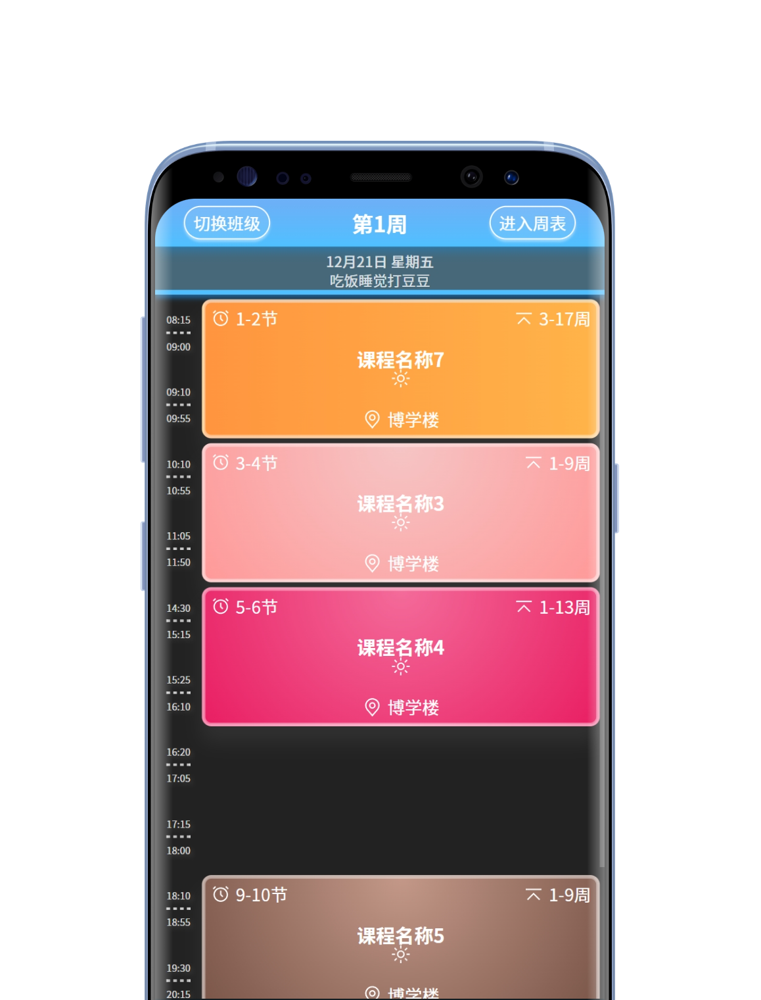

# Uni-App ColorTimetable Modified
### 📅 Uni-APP二次开发ColorTimetable的全栈H5项目 [English Docs](https://github.com/ByteBlader/UniApp-ColorTimetable-Modified/blob/main/README.md)
<br>
<p align='center'>
  </img>
  </img>
  </img>
</p>
<br>

## 特点

- **班级选择列表**： 设计了一个与整体项目风格相匹配的班级选择列表页面。
- **天气与一言**： 在首页处添加了当地日期天气API与一言API用于展示。
- **日课程表视图**： 新增了一种简洁明了的方式支持查看今天或指定日期的课程表。
- **周课程表视图**： 支持查看本周或指定周数的课程表并设计了切换的动画逻辑。
- **重新设计前端**： 更精致的渐变色风格，更美观的圆角设计，更简洁的文本布局。
- **移除的功能**： 数据需在编译时导入，并且不支持用户自行添加或修改课程。

## 运行

1. 克隆仓库：
   ```
   git clone https://github.com/ByteBlader/UniApp-ColorTimetable-Modified.git
   ```
2. 安装依赖：
   ```
   pnpm install
   ```
3. 本地调试：
   ```
   pnpm run dev:h5
   ```
4. 编译项目：
   ```
   pnpm run build:h5
   ```
5. 推荐HBuilder X：
能够使你的Uni-App项目大幅度缩短开发的时间！

## 许可证
本项目基于 [ColorTimetable@Neil](https://github.com/zguolee/ColorTimetable) 二次开发。
本项目遵循原项目 [MIT](https://github.com/ByteBlader/UniApp-ColorTimetable-Modified/blob/main/LICENSE) 许可协议。
